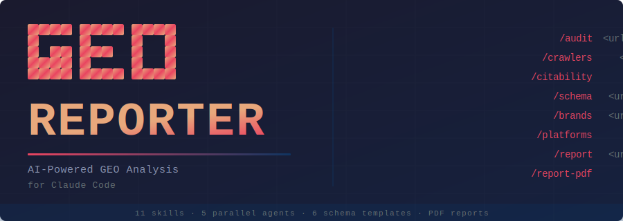

<p align="center">
  
</p>

<h1 align="center">GEO Reporter</h1>

<p align="center">
  <strong>GEO-first, SEO-supported.</strong> Optimize websites for AI-powered search engines<br/>
  (ChatGPT, Claude, Perplexity, Gemini, Google AI Overviews) while maintaining traditional SEO foundations.
</p>

<p align="center">
  AI search is eating traditional search. This tool optimizes for where traffic is going, not where it was.
</p>

<p align="center">
  <em>Highly influenced by <a href="https://github.com/zubair-trabzada/geo-seo-claude">zubair-trabzada/geo-seo-claude</a>. This fork is now actively maintained on its own line of development.</em>
</p>

---

## Why GEO Matters (2026)

| Metric | Value |
|--------|-------|
| GEO services market | $850M+ (projected $7.3B by 2031) |
| AI-referred traffic growth | +527% year-over-year |
| AI traffic conversion rate vs organic | 4.4x higher |
| Gartner: search traffic drop by 2028 | -50% |
| Brand mentions vs backlinks for AI | 3x stronger correlation |
| Marketers investing in GEO | Only 23% |

---

## Quick Start

### One-Command Install (macOS/Linux)

```bash
curl -fsSL https://raw.githubusercontent.com/tzvister/geo-reporter/main/install.sh | bash
```

### Manual Install

```bash
git clone https://github.com/tzvister/geo-reporter.git
cd geo-reporter
./install.sh
```

### Windows (Git Bash)

Requires [Git for Windows](https://git-scm.com/downloads) which includes Git Bash.

```bash
# Option 1: One-command install (run from Git Bash, not PowerShell/CMD)
curl -fsSL https://raw.githubusercontent.com/tzvister/geo-reporter/main/install-win.sh | bash

# Option 2: Manual install
git clone https://github.com/tzvister/geo-reporter.git
cd geo-reporter
./install-win.sh
```

> **Note:** Right-click the folder and select "Open Git Bash here", or open Git Bash and navigate to the directory. Do not use PowerShell or Command Prompt.

### Requirements

- Python 3.8+
- Claude Code CLI
- Git
- Optional: Playwright (for screenshots)

---

## Commands

Open Claude Code and use these commands:

| Command | What It Does |
|---------|-------------|
| `/geo audit <url>` | Full GEO + SEO audit with parallel subagents |
| `/geo quick <url>` | 60-second GEO visibility snapshot |
| `/geo citability <url>` | Score content for AI citation readiness |
| `/geo crawlers <url>` | Check AI crawler access (robots.txt) |
| `/geo llmstxt <url>` | Analyze or generate llms.txt |
| `/geo brands <url>` | Scan brand mentions across AI-cited platforms |
| `/geo platforms <url>` | Platform-specific optimization |
| `/geo schema <url>` | Structured data analysis & generation |
| `/geo technical <url>` | Technical SEO audit |
| `/geo content <url>` | Content quality & E-E-A-T assessment |
| `/geo report <url>` | Generate client-ready GEO report |
| `/geo report-pdf` | Generate professional PDF report with charts & visualizations |

---

## Architecture

```
geo-reporter/
├── geo/                          # Main skill orchestrator
│   └── SKILL.md                  # Primary skill file with commands & routing
├── skills/                       # 15 specialized sub-skills
│   ├── geo-audit/                # Full audit orchestration & scoring
│   ├── geo-botaccess/            # Live AI crawler reachability probe (WAF / Cloudflare detection)
│   ├── geo-citability/           # AI citation readiness scoring
│   ├── geo-crawlers/             # AI crawler access (robots.txt) + Content Signals
│   ├── geo-llmstxt/              # llms.txt standard analysis & generation
│   ├── geo-brand-mentions/       # Brand presence on AI-cited platforms
│   ├── geo-platform-optimizer/   # Platform-specific AI search optimization
│   ├── geo-schema/               # Structured data for AI discoverability
│   ├── geo-technical/            # Technical SEO + agent-readiness signals
│   ├── geo-content/              # Content quality & E-E-A-T
│   ├── geo-report/               # Client-ready markdown report generation
│   ├── geo-report-pdf/           # Professional PDF report with charts
│   ├── geo-prospect/             # CRM-lite prospect pipeline management
│   ├── geo-proposal/             # Auto-generate client proposals
│   └── geo-compare/              # Monthly delta tracking & progress reports
├── agents/                       # 5 parallel subagents
│   ├── geo-ai-visibility.md      # GEO audit, citability, crawlers, brands
│   ├── geo-platform-analysis.md  # Platform-specific optimization
│   ├── geo-technical.md          # Technical SEO analysis
│   ├── geo-content.md            # Content & E-E-A-T analysis
│   └── geo-schema.md             # Schema markup analysis
├── scripts/                      # Python utilities
│   ├── fetch_page.py             # Page fetching, robots.txt parsing, live AI crawler probe
│   ├── citability_scorer.py      # AI citability scoring engine
│   ├── brand_scanner.py          # Brand mention detection
│   ├── llmstxt_generator.py      # llms.txt validation & generation
│   └── generate_pdf_report.py    # PDF report generator (ReportLab)
├── schema/                       # JSON-LD templates
│   ├── organization.json         # Organization schema (with sameAs)
│   ├── local-business.json       # LocalBusiness schema
│   ├── article-author.json       # Article + Person schema (E-E-A-T)
│   ├── software-saas.json        # SoftwareApplication schema
│   ├── product-ecommerce.json    # Product schema with offers
│   └── website-searchaction.json # WebSite + SearchAction schema
├── tests/                        # pytest suite (60 tests covering probes, SSR, scoring)
├── .github/workflows/            # GitHub Actions
│   └── claude-review.yml         # Manual `needs-review`-triggered Claude PR review
├── install.sh                    # One-command installer
├── uninstall.sh                  # Uninstaller
├── requirements.txt              # Python dependencies
├── CHANGELOG.md                  # Release history (Keep a Changelog)
├── CONTRIBUTING.md               # Contribution guidelines + review SLA
├── LICENSE                       # MIT (with upstream attribution)
└── README.md                     # This file
```

---

## Data Storage

The CRM and reporting skills (`/geo prospect`, `/geo proposal`, `/geo compare`) store runtime data outside the Claude Code directory:

```
~/.geo-prospects/
├── prospects.json              # Client/prospect pipeline data
├── proposals/                  # Generated proposal documents
│   └── <domain>-proposal-<date>.md
└── reports/                    # Monthly delta reports
    └── <domain>-monthly-<YYYY-MM>.md
```

This directory is **not removed** by the uninstaller — delete it manually if you no longer need your prospect data.

---

## How It Works

### Full Audit Flow

When you run `/geo audit https://example.com`:

1. **Discovery** — Fetches homepage, detects business type, crawls sitemap
2. **Parallel Analysis** — Launches 5 subagents simultaneously:
   - AI Visibility (citability, crawlers, llms.txt, brand mentions)
   - Platform Analysis (ChatGPT, Perplexity, Google AIO readiness)
   - Technical SEO (Core Web Vitals, SSR, security, mobile)
   - Content Quality (E-E-A-T, readability, freshness)
   - Schema Markup (detection, validation, generation)
3. **Synthesis** — Aggregates scores, generates composite GEO Score (0-100)
4. **Report** — Outputs prioritized action plan with quick wins

### Scoring Methodology

| Category | Weight |
|----------|--------|
| AI Citability & Visibility | 25% |
| Brand Authority Signals | 20% |
| Content Quality & E-E-A-T | 20% |
| Technical Foundations | 15% |
| Structured Data | 10% |
| Platform Optimization | 10% |

---

## Key Features

### Citability Scoring
Analyzes content blocks for AI citation readiness. Optimal AI-cited passages are 134-167 words, self-contained, fact-rich, and directly answer questions.

### AI Crawler Analysis
Checks robots.txt for 17 AI crawlers (GPTBot, ClaudeBot, PerplexityBot, OAI-SearchBot, Claude-SearchBot, Claude-User, Perplexity-User, etc.) classified by purpose — **training**, **search-index**, **live-retrieval**, **traditional-search** — so the GEO impact of blocking can be scored accurately. The "block training, allow retrieval" publisher posture (NYT/WSJ/Reuters/BBC pattern) reads as healthy, not as "partially blocked".

### Live AI Crawler Reachability Probe (`geo-botaccess`)
Goes beyond static robots.txt: replays the homepage as each AI crawler user-agent against your site, fingerprints the WAF/CDN (Cloudflare, AWS WAF, Imperva, Akamai, and 13 others), detects Cloudflare JS challenges with optional Playwright fallback, and surfaces declared-vs-actual mismatches as critical findings. Built for the iterative fix-and-retest loop after a WAF rule change.

### Content Signals & Agent-Readiness
Detects [IETF Content Signals](https://contentsignals.org/) (`Content-Signal: ai-train=no, search=yes` directives in robots.txt), RFC 8288 `Link:` headers (`api-catalog`, `service-doc`, `mcp-server-card`), and Markdown content negotiation (`Accept: text/markdown`). Non-scoring — surfaces emerging-spec signals that platforms like Cloudflare and isitagentready.com look for.

### Brand Mention Scanning
Brand mentions correlate 3x more strongly with AI visibility than backlinks. Scans YouTube, Reddit, Wikipedia, LinkedIn, and 7+ other platforms.

### Platform-Specific Optimization
Only 11% of domains are cited by both ChatGPT and Google AI Overviews for the same query. Provides tailored recommendations per platform.

### llms.txt Generation
Generates the emerging llms.txt standard file that helps AI crawlers understand your site structure.

### Client-Ready Reports
Generates professional GEO reports in markdown or PDF format. PDF reports include score gauges, bar charts, platform readiness visualizations, color-coded tables, and prioritized action plans — ready to deliver to clients.

---

## Use Cases

- **GEO Agencies** — Run client audits and generate deliverables
- **Marketing Teams** — Monitor and improve AI search visibility
- **Content Creators** — Optimize content for AI citations
- **Local Businesses** — Get found by AI assistants
- **SaaS Companies** — Improve entity recognition across AI platforms
- **E-commerce** — Optimize product pages for AI shopping recommendations

---

## Uninstall

```bash
./uninstall.sh
```

Or manually:
```bash
rm -rf ~/.claude/skills/geo ~/.claude/skills/geo-* ~/.claude/agents/geo-*.md
```

---

## Versioning & Releases

GEO Reporter follows [Semantic Versioning](https://semver.org/). Tagged releases are published on GitHub with notes covering each change.

- [Latest release](https://github.com/tzvister/geo-reporter/releases/latest) — install URL, breaking changes, and highlights
- [All releases](https://github.com/tzvister/geo-reporter/releases) — full history
- [CHANGELOG.md](CHANGELOG.md) — running record of every change in [Keep a Changelog](https://keepachangelog.com/) format

---

## License

MIT License — see [LICENSE](LICENSE) for the full text and the upstream attribution notice.

---

## Contributing

Issues and PRs welcome. This fork is actively maintained — bug reports, new bot-class definitions as labs publish them, schema additions, and platform-readiness updates are all in scope.

---

Built for the AI search era.
